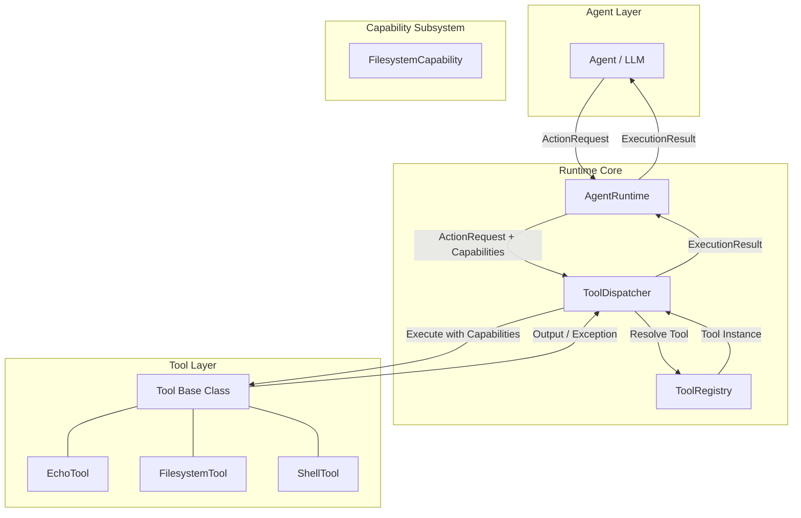

# Agent Runtime Engine (`agent-exec`)

[](https://www.python.org/)
[](https://opensource.org/licenses/MIT)
[]()

A lightweight, systems-oriented execution runtime and substrate for autonomous agents.

---

## 1. Overview

**Agent Runtime Engine (`agent-exec`)** provides a deterministic, low-level execution layer through which autonomous agents execute actions in a controlled and structured environment. 

Rather than allowing autonomous agents or LLMs to directly invoke system tools, run arbitrary shell commands, or perform unrestricted filesystem modifications, all interactions are formalized as structured **Action Requests** and gated by explicit **Capabilities**.

```text
ActionRequest (tool, operation, arguments, capabilities)
   │
   ▼
AgentRuntime
   │
   ▼
ToolDispatcher ──► ToolRegistry
   │
   ▼
Tool (EchoTool / FilesystemTool / ShellTool)
   │
   ▼
ExecutionResult (status: SUCCESS | FAILED, result, error)
```

---

## 2. Motivation & Design Philosophy

Direct tool invocation by autonomous agents introduces severe reliability and security risks:
- **Unconstrained System Mutation**: Agents can modify directories outside their intended working tree or execute arbitrary subshell commands without observation.
- **Exception Leakage**: Raw system and operating system exceptions leak directly into agent reasoning loops, causing cascading agent crashes or hallucinated error recovery.
- **Tight Coupling**: Embedding execution mechanics inside agent prompt loops makes it difficult to retrofit capabilities, audit logging, sandboxing, or rate limiting later.

`agent-exec` decouples agent reasoning from execution mechanics through three core principles:

1. **Explicit Data Boundaries**: Tools only accept structured dictionaries and return standardized `ExecutionResult` objects.
2. **Capability-Gated Resource Access**: Tools do not unilaterally decide their allowed access roots; instead, the action must carry the granted `Capability`.
3. **Deterministic Error Taxonomy**: All runtime exceptions and execution failures are captured, categorized, and structured into `ErrorPayload` objects.

---

## 3. Architecture



---

## 4. Core Components

### 4.1 `AgentRuntime`
The high-level orchestrator that coordinates action validation, capability dispatching, and tool registry management.
- Accepts both `ActionRequest` objects and raw dictionary payloads.
- Normalizes and attributes malformed requests to structured failure results.

### 4.2 `ToolRegistry`
The central catalog for available tools:
- Enforces unique tool names (no duplicate registrations).
- Provides deterministic lookup and tool inventory queries (`list_tools()`, `has()`, `get()`).

### 4.3 `ToolDispatcher`
The mediation layer between requests and tools:
- Resolves target tools from the registry.
- Verifies that the requested `operation` is supported by the tool.
- Forwards granted capabilities to tool executions.
- Traps all unhandled exceptions, converting them into structured `ExecutionResult` failures.

### 4.4 Built-in Tools

| Tool | Name | Supported Operations | Description |
| :--- | :--- | :--- | :--- |
| **`EchoTool`** | `echo` | `run` | Deterministic message echoing for pipeline testing and verification. |
| **`FilesystemTool`** | `filesystem` | `list`, `list_files`, `read`, `write` | Workspace-isolated file operations strictly constrained to a granted `FilesystemCapability` root. Prevents path traversal (`../`) and unauthorized path access. |
| **`ShellTool`** | `shell` | `run`, `exec`, `execute` | Synchronous subshell process execution within the workspace directory using standard library `subprocess`. Captures `stdout`, `stderr`, and process `exit_code`. |

---

## 5. Data & Execution Models

### 5.1 `ActionRequest`

Represents an explicit intent submitted by an agent:

```python
from agent_runtime import ActionRequest, FilesystemCapability

request = ActionRequest(
    action_id="act_001",
    tool="filesystem",
    operation="write",
    arguments={
        "path": "greeting.txt",
        "content": "Hello from Agent Runtime Engine!"
    },
    capabilities=[
        FilesystemCapability(root="./workspace")
    ]
)
```

JSON representation:
```json
{
  "action_id": "act_001",
  "tool": "filesystem",
  "operation": "write",
  "arguments": {
    "path": "greeting.txt",
    "content": "Hello from Agent Runtime Engine!"
  },
  "capabilities": [
    {
      "type": "filesystem",
      "root": "/path/to/workspace"
    }
  ]
}
```

### 5.2 `ExecutionResult`

Every tool invocation returns a normalized `ExecutionResult` containing the execution status, output data, or structured error details.

#### Successful Execution
```json
{
  "action_id": "act_001",
  "status": "SUCCESS",
  "result": "File written successfully",
  "error": null
}
```

#### Failed Execution
```json
{
  "action_id": "act_002",
  "status": "FAILED",
  "result": null,
  "error": {
    "type": "ToolExecutionError",
    "message": "Access denied: path '../outside.txt' resolves outside capability root",
    "details": null
  }
}
```

### 5.3 Error Taxonomy

All runtime and tool errors inherit from `AgentRuntimeError`:

| Error Type | Trigger Condition |
| :--- | :--- |
| `InvalidAction` | Missing required fields, invalid types, or malformed action request payloads. |
| `ToolNotFound` | The requested tool name is not registered in `ToolRegistry`. |
| `OperationNotSupported` | The requested operation is not supported by the resolved tool. |
| `ToolExecutionError` | Tool-level execution failure (e.g., missing capabilities, file not found, path traversal violation, process timeout). |

---

## 6. Capability Model

Capabilities explicitly define what resources an action is authorized to access during execution.

### `FilesystemCapability`

Restricts filesystem access strictly to a designated root directory:

```python
from agent_runtime import FilesystemCapability

# Grant access exclusively to a designated directory
fs_cap = FilesystemCapability(root="./workspace")
```

- **Enforcement**: If an action request targeting `FilesystemTool` does not include a `FilesystemCapability`, the action is denied.
- **Containment**: Any path that resolves outside the capability root (including relative directory traversals like `../../secret.txt` or absolute paths outside the root) raises `ToolExecutionError`.

---

## 7. Quickstart & Usage Example

```python
from pathlib import Path
from agent_runtime import (
    AgentRuntime,
    ActionRequest,
    EchoTool,
    FilesystemTool,
    FilesystemCapability,
    ShellTool,
)

# 1. Initialize runtime and register tools
runtime = AgentRuntime()
workspace = Path("./workspace").resolve()

runtime.register_tool(EchoTool())
runtime.register_tool(FilesystemTool())
runtime.register_tool(ShellTool(workspace_dir=workspace))

# 2. Execute an action with granted capabilities
fs_cap = FilesystemCapability(root=workspace)

write_action = ActionRequest(
    action_id="act_01",
    tool="filesystem",
    operation="write",
    arguments={"path": "notes.txt", "content": "Autonomous execution active."},
    capabilities=[fs_cap],
)

result = runtime.execute(write_action)
print(f"Status: {result.status.value}")  # SUCCESS
print(f"Output: {result.result}")        # File written successfully

# 3. Read back via ShellTool
shell_action = ActionRequest(
    action_id="act_02",
    tool="shell",
    operation="run",
    arguments={"command": "cat notes.txt"},
)

shell_result = runtime.execute(shell_action)
print(f"Process stdout: {shell_result.result['stdout']}")
print(f"Exit code: {shell_result.result['exit_code']}")
```

Run the complete built-in example:
```bash
python examples/basic_execution.py
```

---

## 8. Directory Structure

```text
agent-runtime-engine/
├── README.md
├── pyproject.toml
├── examples/
│   └── basic_execution.py         # End-to-end usage demonstration
├── src/
│   └── agent_runtime/
│       ├── __init__.py             # Public package exports
│       ├── capabilities.py         # Capability models (FilesystemCapability)
│       ├── dispatcher.py           # ToolDispatcher execution & validation
│       ├── errors.py               # Exception hierarchy
│       ├── models.py               # ActionRequest, ExecutionResult, ErrorPayload
│       ├── registry.py             # ToolRegistry catalog
│       ├── runtime.py              # AgentRuntime orchestrator
│       └── tools/
│           ├── __init__.py
│           ├── base.py             # Tool base class interface
│           ├── echo.py             # EchoTool implementation
│           ├── filesystem.py       # Capability-aware FilesystemTool
│           └── shell.py            # Synchronous ShellTool
└── tests/
    ├── test_action_model.py        # Action & Result model unit tests
    ├── test_capabilities.py        # Capability & isolation tests
    ├── test_dispatcher.py          # Dispatcher unit tests
    ├── test_echo.py                # EchoTool tests
    ├── test_filesystem.py          # Filesystem operations & traversal tests
    ├── test_registry.py            # Registry tests
    ├── test_runtime.py             # Runtime pipeline tests
    └── test_shell.py               # Shell execution & exit code tests
```

---

## 9. Running Tests

Run the full pytest test suite:

```bash
python -m pytest
```

Run with verbose output and coverage:

```bash
python -m pytest -v
```

---

## 10. Scope & Non-Goals

To maintain architectural focus on the core execution substrate, the following are intentionally deferred to future phases:
- LLM prompt orchestration & agent memory frameworks
- Complex authorization policy engines (RBAC/ABAC)
- OS-level kernel sandboxing (eBPF, seccomp, bubblewrap, containers)
- Asynchronous execution loops & background task queues
- Remote tool protocols & Distributed MCP (Model Context Protocol)
- REST / Web APIs